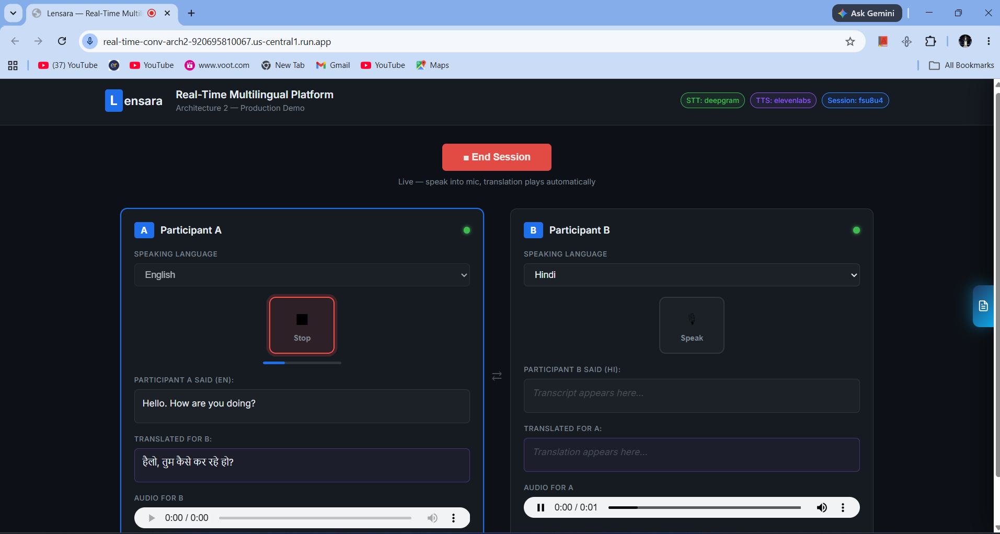
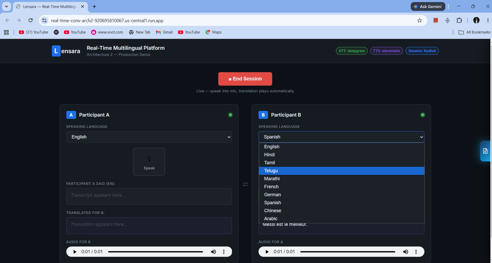
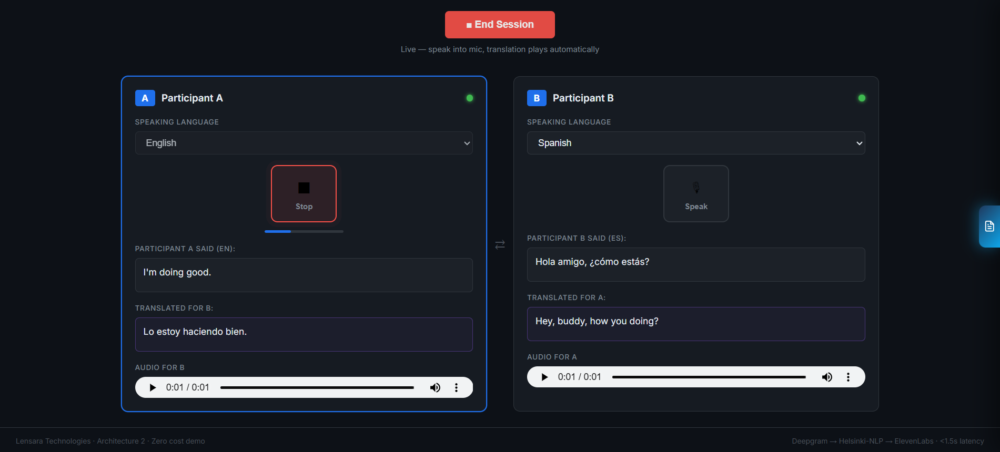
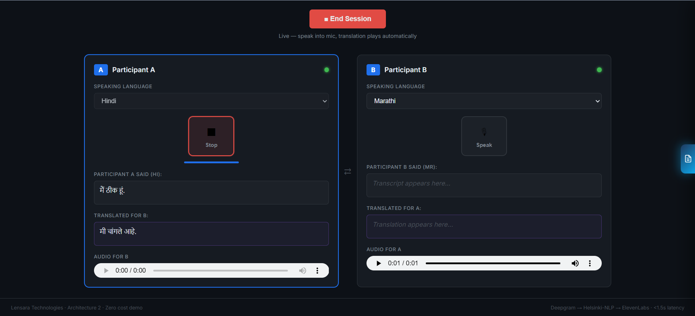
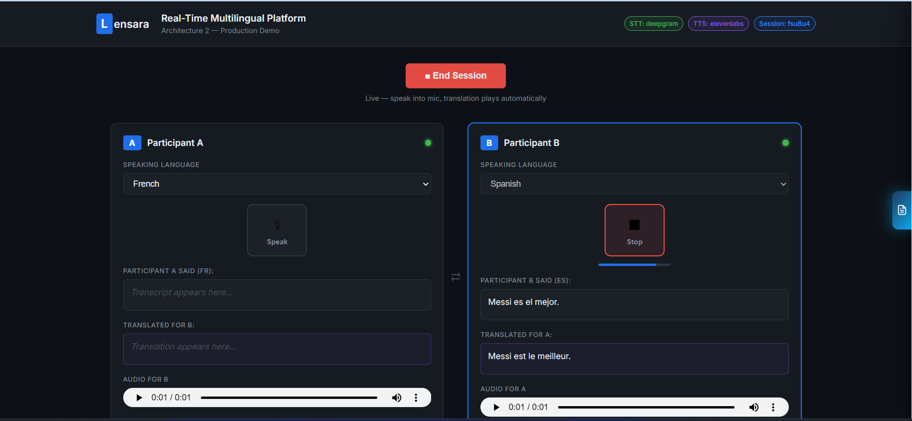
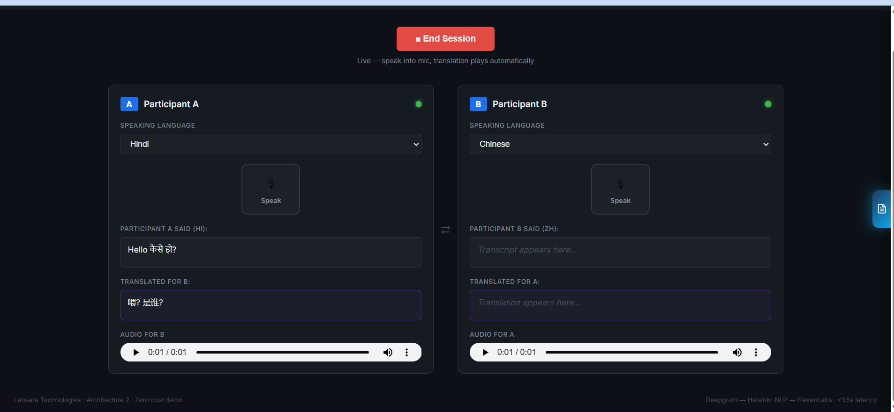

# Real-Time Multilingual Conversation Platform

**Architecture 2** — a low-latency, two-way speech translation system that lets two people speak different languages and understand each other in near real time: speech in, translated speech out, per listener.

🔗 **Live demo:** [real-time-conv-arch2-920695810067.us-central1.run.app](https://real-time-conv-arch2-920695810067.us-central1.run.app)
> First request after idle may take 20–30s (cold start — models reload). Subsequent turns are fast.

---

## Screenshots

<p align="center">
  <br><br>
  <br><br>
  <br><br>
  <br><br>
  <br><br>
  <br><br>
  
</p>

---

## What it does

Two participants (A and B) each pick their spoken language. When one speaks:

1. Speech is transcribed in real time.
2. The transcript is translated into the *other* participant's chosen language.
3. The translation is synthesized back into natural-sounding speech and played to them.
4. Either participant can switch their language mid-conversation, and the pipeline reconfigures live — no restart required.

Built to explore what a production-shaped, low-latency, multi-engine STT/translation/TTS pipeline actually requires once you get past the demo-in-a-notebook stage: connection lifecycle management, engine fallback, graceful degradation, and language-switch correctness.

---

## Architecture

```
┌─────────────┐     WebSocket      ┌──────────────────────────────┐
│  React SPA   │ ◄─────────────►   │        FastAPI Server         │
│ (Vite/JSX)   │   PCM audio /      │                                │
└─────────────┘   JSON events       │  ┌──────────┐   ┌───────────┐ │
                                     │  │   STT    │   │Translation│ │
                                     │  │ Deepgram │──▶│ MarianMT  │ │
                                     │  │ /Whisper │   │(Helsinki- │ │
                                     │  └──────────┘   │    NLP)   │ │
                                     │                 └─────┬─────┘ │
                                     │                       ▼       │
                                     │                 ┌───────────┐ │
                                     │                 │    TTS    │ │
                                     │                 │ElevenLabs │ │
                                     │                 │ / gTTS    │ │
                                     │                 └───────────┘ │
                                     └──────────────────────────────┘
```

**STT routing:** Deepgram Nova-2 is used for natively-supported languages (English, Hindi, Tamil, Telugu, French, German, Spanish, Chinese, Arabic, and more). Languages Deepgram doesn't support (Marathi, Bengali, Gujarati, Kannada, Malayalam, Urdu, Punjabi) transparently fall back to a local `faster-whisper` model — decided per-language, and re-decided live if a participant switches languages mid-session.

**Translation:** Helsinki-NLP MarianMT models, quantized to INT8 for CPU inference. Direct model pairs are used where they exist; unsupported pairs (e.g. Spanish → Hindi) automatically pivot through English.

**TTS:** ElevenLabs multilingual neural voices by default, with automatic fallback to gTTS if the API is unavailable or rate-limited — the conversation never breaks, it just gets a flatter voice until ElevenLabs is available again.

---

## Tech stack

| Layer | Technology |
|---|---|
| Frontend | React (Vite), vanilla WebSocket + Web Audio API |
| Backend | FastAPI, Python 3.12, asyncio |
| Speech-to-text | Deepgram Nova-2 (streaming) + faster-whisper (local fallback) |
| Translation | Helsinki-NLP MarianMT (Transformers + PyTorch, quantized) |
| Text-to-speech | ElevenLabs (neural) + gTTS (fallback) |
| Deployment | Docker, Google Cloud Run |

---

## Key engineering problems solved

This project went through real debugging rounds against actual multi-user sessions, not just single-user demos. A few of the harder problems:

- **Live STT engine switching.** Deepgram's language is fixed for the lifetime of a connection, and some languages only work on Whisper at all. A `language_change` message now correctly tears down and restarts whatever engine configuration the new language requires — including flushing any audio buffered under the *old* language first, so nothing spoken right before a switch gets lost.
- **Stale-connection race conditions.** A reconnecting client could have its old connection's cleanup code delete a fresher, already-reconnected session entry purely by user ID. Session removal now checks connection identity, not just the key.
- **Idle-timeout disconnects.** Deepgram's connection idle timer wasn't being satisfied by naive "silence" padding; it now sends the protocol's actual documented keepalive message.
- **Turn-latency reduction.** Independent steps in the translate → notify → synthesize pipeline (relaying the raw transcript to the listener, notifying the sender, generating audio) are run concurrently instead of sequentially, and a dead ElevenLabs call is short-circuited after a confirmed quota error instead of being retried every single turn.

---

## Running locally

### Prerequisites
- Python 3.12
- Node.js 20+
- (Optional) Deepgram API key, ElevenLabs API key — the app runs without either, falling back to Whisper + gTTS

### Backend
```bash
pip install -r requirements.txt --break-system-packages
cp .env.example .env   # add your API keys if you have them
python server.py
```

### Frontend
```bash
cd frontend
npm install
npm run build
```

The FastAPI server serves the built frontend directly — visit `http://localhost:8000`.

### Health check
```bash
curl http://localhost:8000/health
```

---

## Deployment

Deployed on **Google Cloud Run** via a multi-stage Docker build (frontend build → Python runtime). See `Dockerfile`.

```bash
gcloud run deploy real-time-conv-arch2 \
  --source . \
  --region us-central1 \
  --allow-unauthenticated \
  --port 8080 \
  --memory 16Gi \
  --cpu 4 \
  --timeout 3600 \
  --session-affinity \
  --set-env-vars DEEPGRAM_API_KEY=...,ELEVENLABS_API_KEY=...,HF_TOKEN=...
```

> Note: session state currently lives in-process (in-memory), so this is deployed as a single instance (`--max-instances 1`). A multi-instance production version would move session state to Redis/Memorystore.

---

## Project structure

```
.
├── server.py              # FastAPI app, WebSocket handling, pipeline orchestration
├── src/
│   ├── session.py         # In-memory session/connection management
│   ├── deepgram_stt.py    # Deepgram streaming STT + Whisper fallback
│   ├── translate.py       # MarianMT translation with English-pivot routing
│   └── elevenlabs_tts.py  # ElevenLabs TTS + gTTS fallback
├── frontend/
│   └── src/
│       ├── App.jsx
│       └── TranslationPanel.jsx   # Per-participant mic capture + playback
├── Dockerfile
└── requirements.txt
```

---

## Known limitations

- Single-session-at-a-time deployment (in-memory session store, see above).
- ElevenLabs quota-exhaustion falls back to gTTS, which is lower voice quality.
- Whisper transcription accuracy for some Indic languages can vary depending on audio quality — this is an active area of tuning.

---

## License

See [`LICENSE`](./LICENSE).
